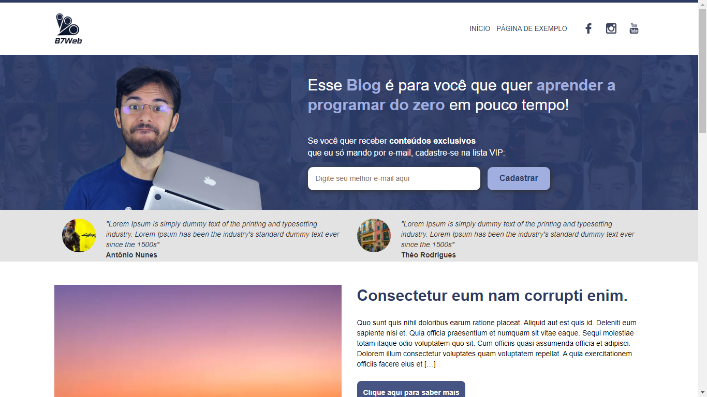

<h1 align="center"> Tema Blog B7Web </h1>

Esse tema foi criado para o blog da B7Web uma escola de tecnologia com os melhores recursos e totalmente gerencialvel....

  <a href="#-tecnologias">Tecnologias</a>&nbsp;&nbsp;&nbsp;|&nbsp;&nbsp;&nbsp;
  <a href="#-projeto">Projeto</a>&nbsp;&nbsp;&nbsp;|&nbsp;&nbsp;&nbsp;
  <a href="#-layout">Layout</a>&nbsp;&nbsp;&nbsp;|&nbsp;&nbsp;&nbsp;
  <a href="#memo-licença">Licença</a>

  

 

  <!---->

## 🚀 Tecnologias

Esse projeto foi desenvolvido com as seguintes tecnologias:

- PHP
- HTML
- CSS
- Sass
- Bootstrap versão 3.3.7
- Git e Github

## 💻 Projeto

O projeto foi desenvolvido para o blog B7Web
totalmente gerenciável e atualizado com as melhores tecnologias e padrões da comunidade.

## :memo: Licença

Esse projeto está sob a licença MIT.

---

Feito com ♥ by Vanderlei

# Tema Blog B7Web
